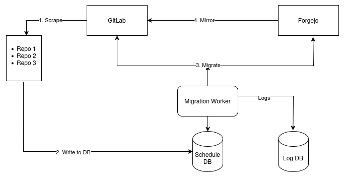

# GitLab to Forgejo Migration Script

> ⚠️ **Status:** The scripts are currently undergoing testing.

This project provides a set of Python scripts to migrate data from **GitLab** to **Forgejo** using the GitLab API.  
It combines [`pyforgejo`](https://codeberg.org/harabat/pyforgejo) with Python’s `requests` library to perform a comprehensive migration.

## Features

The migration supports:

- **Repositories**
    - Source code
    - Wikis
    - Issues
    - Merge Requests
    - Labels
    - Milestones
    - Release artifacts
- **Users**
    - Username
    - Email address
- **Groups**
    - Group creation
    - Adding users to groups

### Tested Versions

- GitLab: **18.7.1**
- Forgejo: **12.0.1**

## Migration Concept
The migration follows a staged approach to ensure control, traceability, and minimal disruption to existing CI/CD pipelines.

1. **Pull repositories from GitLab**  
   All accessible repositories are queried from GitLab via the API and exported into a structured list (CSV).  
   This provides a complete overview of available projects before any data is migrated.

2. **Review and edit the repository list**  
   The generated CSV file can be manually reviewed and edited.  
   This allows selecting, excluding, or adjusting repositories before migration (for example, skipping archived or deprecated projects).

3. **Migrate groups from GitLab to Forgejo**  
   GitLab groups are created in Forgejo, and users are added accordingly.  
   This step ensures that permissions and group structures exist before repositories are imported.

4. **Migrate selected repositories from GitLab to Forgejo**  
   All repositories listed in the preselected CSV file are migrated from GitLab to Forgejo.  
   This includes repository data as well as associated metadata such as issues, merge requests, labels, milestones, and release artifacts.

5. **Create push mirrors back to GitLab**  
   After migration, Forgejo repositories are configured to push back to GitLab.  
   This allows existing GitLab CI/CD pipelines to continue running during the transition phase, enabling a gradual and low-risk migration.



## Usage

### Using a Virtual Environment

To keep your system clean, it is recommended to run the scripts inside a virtual environment:

```bash
python3 -m venv migration
source migration/bin/activate
python3 -m pip install -r requirements.txt
```

You can inspect available options via `--help`:

- `python migrate.py --help`
- `python create_push_mirrors.py --help`

### Full Migration Workflow

To migrate users, groups, and repositories from GitLab to Forgejo:

1. Pull all repositories from GitLab:
```bash
cd src/
python get_repos.py
```

2. Migrate groups:
```bash
python migrate.py --groups
```

3. Migrate projects and corresponding users:
```bash
python migrate.py --projects --migrate-from-csv=../gitlab_repos.csv
```
### Creating Push Mirrors Back to GitLab
If you want to create push mirrors back to GitLab:

```bash
python create_push_mirrors.py --to-gitlab
```

## Configuration
`.migrate.ini`

Create a configuration file named `.migrate.ini` in the same directory as the scripts.
> 💡 The file `.migrate.ini` is included in `.gitignore` and should not be committed.

Example configuration:

```bash
[migrate]
gitlab_url = https://codebase.helmholtz.cloud
gitlab_token = <your-gitlab-token>
gitlab_admin_user = <gitlab-admin-user>
gitlab_admin_pass = <your-gitlab-password>
forgejo_url = https://forgejo.example.com
forgejo_token = <your-forgejo-token>
forgejo_admin_user = <forgejo-admin-user>
forgejo_admin_pass = <your-forgejo-password>
```
## Credits and Fork Information
This project is a fork of: [gitlab_to_forgejo](https://github.com/GEANT/gitlab-to-forgejo).

Compared to the original project, this fork adds:
* Import of issues
* Import of milestones
* Import of labels
* Email address mapping per user


## License

This project is licensed under the [MIT License](LICENSE).


